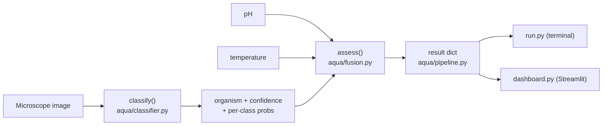

# AquaSentinel AI — Project & Pipeline Overview

Read this first if you want to understand *what the project does* and *how one
water sample flows through the code*. It maps each step of the pipeline to the
exact file and function that does the work, so you can follow along in the
source.

- New to the project and just want to run it? → [`../README.md`](../README.md)
- Want the architecture theory and the hardware plan? → [`PROJECT_STATEMENT.md`](PROJECT_STATEMENT.md)
- Presenting it? → [`DEMO_SCRIPT.md`](DEMO_SCRIPT.md)
- Swapping in a real CNN? → [`UPGRADE_REAL_MODEL.md`](UPGRADE_REAL_MODEL.md)

---

## What it does, in one paragraph

AquaSentinel takes a **microscope image** of a water drop plus two sensor
readings — **pH** and **temperature** — and returns a contamination **risk
level** (LOW / MODERATE / HIGH) with a plain-language recommendation. The image
tells us *which* microorganism is present; the sensors tell us *how dangerous*
the conditions are. It is an early-warning screening tool, not a lab test.

It runs with zero hardware and zero internet: mock samples stand in for the real
camera and sensors so the demo always works.

---

## The pipeline (one sample, end to end)



Each numbered step below corresponds to a real function.

### 1. Get the inputs — `aqua/pipeline.py`, `aqua/mock_data.py`
`process_sample()` is the single entry point for one sample. The image comes
from disk (or a live upload); the pH and temperature come from one of three
sources:

- **Mock pendrive** (default): `mock_data.generate_pendrive()` writes an
  `images/` folder plus a `readings.csv`, exactly the shape a real capture
  device would produce. `process_pendrive()` then pairs each image with its row.
- **Manual**: `--ph` / `--temp` flags on `run.py`, or the sliders in the dashboard.
- **Live hardware** (optional): `serial_reader.read_from_serial()` (Arduino over
  USB) or `read_from_nodemcu()` (NodeMCU over Wi-Fi JSON).

### 2. Classify the organism — `aqua/classifier.py`
`classify(image)` is the vision model. It does **not** use a lookup table — it
reads pixels:

1. `extract_features()` resizes the image to 128px and computes **8 numeric
   features**: mean R/G/B, green dominance (chlorophyll → algae/cyanobacteria),
   grayscale texture, edge density, and dark-pixel fraction at two scales (which
   separates *many tiny rods* like E. coli from *few large blobs* like an amoeba).
2. The feature vector is standardised and compared to one learned **prototype
   per organism** (nearest-centroid). Prototypes are fit once from mock images
   and cached in `aqua/prototypes.json`.
3. A softmax over the negative distances (`_SOFTMAX_T = 0.6`) turns them into a
   `confidence` and a full `probs` map.

Returns `{"label", "confidence", "probs"}`. The organism catalogue it chooses
from lives in `aqua/config.py` (`ORGANISMS`): clean water, algae, cyanobacteria,
Giardia, Cryptosporidium, E. coli, and Naegleria.

> **Upgrade hook:** set the `AQUASENTINEL_MODEL` env var and the same function
> routes to a fine-tuned CNN instead — the return shape is identical, so nothing
> downstream changes. See [`UPGRADE_REAL_MODEL.md`](UPGRADE_REAL_MODEL.md).

### 3. Fuse image + sensors into a risk verdict — `aqua/fusion.py`
`assess()` is deliberately a transparent rule (late/decision-level fusion), so
every verdict can be explained line by line:

```
risk_score = 2 * organism_danger        # danger 0=clean … 3=severe (Naegleria)
           + 1  if pH outside 6.5–8.5    # PH_SAFE_MIN / PH_SAFE_MAX in config.py
           + 1  if temperature > 30 °C   # TEMP_WARM_C in config.py

score <= 1 → LOW        2–3 → MODERATE        >= 4 → HIGH
```

It also builds the human-readable `reasons` list (e.g. *"Detected E. coli
(Bacteria), a risk organism. pH 6.54 is within the safe range."*) and flags
`low_confidence` when the classifier is unsure (< 0.45).

### 4. Assemble the result — `aqua/pipeline.py`
`process_sample()` merges the classification, the organism metadata from
`config.ORGANISMS`, the raw pH/temperature, and the fusion verdict into **one
result dict**. This dict is the single contract both front-ends render, which is
why the terminal and the dashboard always agree.

### 5. Show it — `run.py` and `dashboard.py`
- `run.py` prints a coloured result card per sample and a batch summary.
- `dashboard.py` renders the same data as a Streamlit page (image thumbnail,
  metrics, expandable "why this verdict", and a downloadable CSV report).

---

## The result dict (the contract)

Everything the UIs display comes from this one dictionary, produced by
`pipeline.process_sample()`:

| Key | Meaning | Produced by |
| --- | --- | --- |
| `sample_id`, `image_path` | Which sample | pipeline |
| `organism`, `organism_key`, `kind`, `disease` | What was detected | classifier + config |
| `confidence`, `probs` | How sure, per class | classifier |
| `ph`, `temperature` | Sensor context | inputs |
| `risk`, `score`, `status`, `recommendation` | The verdict | fusion |
| `reasons`, `low_confidence` | The explanation | fusion |
| `true_label`, `correct` | Grading vs. the label (mock data only) | pipeline |

---

## Where each file fits

```
aquasentinel/
├─ run.py              CLI front-end — prints result cards + batch summary
├─ dashboard.py        Streamlit front-end — same data, visual screen
│
├─ aqua/
│   ├─ config.py       Organism catalogue, pH/temp thresholds, risk rules (start here)
│   ├─ mock_data.py    Generates the synthetic pendrive (images + readings.csv)
│   ├─ classifier.py   Image → organism + confidence (nearest-centroid model)
│   ├─ fusion.py       Organism + pH + temp → risk score & recommendation
│   ├─ pipeline.py     Glue: builds the result dict both front-ends render
│   └─ serial_reader.py  Optional live pH/temp from Arduino (USB) or NodeMCU (Wi-Fi)
│
├─ arduino/            Firmware: Uno reads sensors, NodeMCU relays over Wi-Fi
└─ docs/               This overview + project statement, demo script, upgrade guide
```

---

## What's real vs. simulated (be honest about this)

- **Real:** the classifier reads actual pixels and makes a genuine prediction;
  the pH/temperature fusion logic is real.
- **Simulated for the POC:** the microscope images and sensor CSV are generated
  stand-ins (`mock_data.py`) so the demo runs anywhere.
- **A caveat to state plainly:** because the classifier's prototypes are learned
  from the *same* generator that produces the demo images, the "matches labels"
  count reflects self-consistency on synthetic data — not real-world accuracy.
  The design is built so a real image dataset or CNN drops in without changing
  anything downstream.
- **Not claimed:** species-level certainty or a replacement for a laboratory.
```
