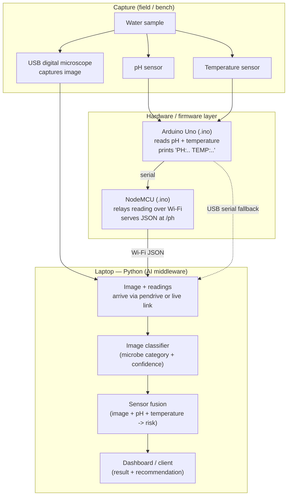
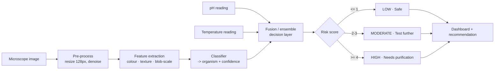
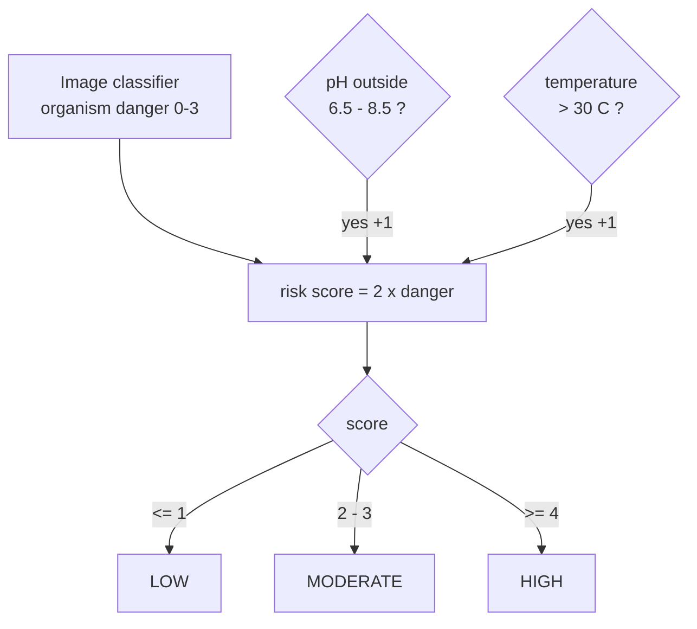

# AquaSentinel AI — Project Statement

**AI-Assisted Water Biosurveillance & Microbial Risk Assessment**

AquaSentinel AI is a low-cost early-warning system that screens a water sample
for microbial contamination in seconds. It captures a microscope image and two
water-quality sensor readings (**pH** and **temperature**), uses a machine-learning
model to classify the microorganism category from the image, then **fuses** that
result with the sensor readings to produce a contamination **risk level** and a
plain-language recommendation. It does not replace a laboratory — it tells you
*when to get one*.

---

## 1. System architecture

Three cooperating layers, matching the hardware plan. The Arduino reads sensors,
the NodeMCU relays them over Wi-Fi, and the laptop does the AI and the display.



**Why this split (the "middleware" idea):** the microscope and sensors are dumb
data sources; the Python layer is the intelligent middleman that turns raw data
into a decision; the dashboard is the consumer that shows it. Python **reads**
the hardware — it never controls it.

---

## 2. Processing pipeline (what happens per sample)



---

## 3. How each component works

### 3.1 Microscope image → classifier
The image is the **primary signal**: it's the only input that can say *which*
organism is present. The classifier reduces each image to a small set of
numeric **features** (below), then assigns the closest microorganism category
with a confidence score.

- **POC model:** a nearest-centroid classifier over hand-designed colour/texture
  features — instant, no GPU, fully explainable.
- **Upgrade model:** a fine-tuned CNN (MobileNet/EfficientNet, transfer learning)
  that learns the features itself. Same inputs/outputs, so nothing else changes.

### 3.2 pH sensor → Arduino Uno
The Uno reads the analog pH probe on `A0`, converts the ADC value to a voltage,
and applies a calibrated linear formula to get pH (0–14). It prints a clean line
(`PH:7.24 TEMP:26.5`) once per second.

### 3.3 Temperature sensor → Arduino Uno
An analog temperature sensor (e.g. LM35 on `A1`) is read the same way. Warm water
matters biologically, so temperature is carried alongside pH.

### 3.4 NodeMCU → Wi-Fi
The NodeMCU receives the Uno's serial line, keeps the latest values, and serves
them as JSON on the local network (`http://<ip>/ph`). The laptop can poll this,
or read the Uno directly over USB. For the POC, values also arrive from the
pendrive's `readings.csv`, so no live link is required.

### 3.5 Laptop → fusion + dashboard
The Python layer matches each image to its sensor reading, classifies the image,
fuses the three signals into a risk verdict, and renders it (terminal or a
Streamlit screen) with the organism, confidence, pH, temperature, risk, and the
recommendation.

---

## 4. How image, temperature, and pH features are used in classification

This is the core of the system. **The image decides *what* organism; the sensors
decide *how dangerous* the situation is.** They combine in a late-fusion step.

### 4.1 Image features (drive organism classification)

| Feature | What it measures | What it reveals |
| --- | --- | --- |
| Mean R / G / B | Average colour of the field | Stain / pigment of the sample |
| **Green dominance** | Green minus red-blue average | Chlorophyll → **algae / cyanobacteria** |
| Grayscale std (texture) | Contrast / busyness | Clear water vs. crowded field |
| **Edge density** | Amount of outline/detail | Density of particles/organisms |
| Dark fraction (full res) | % of dark pixels at full detail | Total organism/particle load |
| **Dark fraction (coarse res)** | % dark after 8× downsampling | Small specks vanish, big bodies remain |
| Dark full ÷ dark coarse | Ratio of the two above | **Organism size**: many tiny rods (E. coli) vs. few large blobs (amoeba) |

The classifier compares this feature vector to a learned prototype per category
and picks the nearest one; the softmax of the distances gives the **confidence**.
(A CNN upgrade learns richer versions of these same cues automatically.)

### 4.2 pH feature (context, used in fusion — not in image classification)
pH does not identify an organism, so it is **not** fed to the image classifier.
It enters the **fusion** step: a reading outside the safe band **6.5–8.5**
signals abnormal water chemistry that often accompanies contamination, and adds
to the risk score.

### 4.3 Temperature feature (context, used in fusion)
Temperature is also a fusion context feature. Water warmer than **30 °C** favours
microbial growth — critically, *Naegleria fowleri* (the brain-eating amoeba)
thrives in warm water — so warm readings add to the risk score.

### 4.4 The fusion rule (decision-level ensemble)



```
risk_score = 2 * organism_danger        # 0=clean … 3=severe (e.g. Naegleria)
           + 1  if pH outside 6.5–8.5
           + 1  if temperature > 30 °C

score <= 1 -> LOW        2–3 -> MODERATE        >= 4 -> HIGH
```

**Worked example.** An image classified as *Naegleria* (danger 3) gives a base of
6 → already HIGH. A warm reading (33 °C) adds +1, reinforcing it, and the
explanation reads: *"Detected Naegleria (amoeba), a severe risk organism;
temperature 33 °C is warm, favouring growth."* The image found the threat; the
temperature explained why it's especially dangerous now.

### 4.5 Optional trained fusion (future upgrade)
The rule above can be replaced by a small **meta-classifier** (logistic
regression / random forest / tiny MLP) that takes the concatenated vector
`[class_probabilities…, pH, temperature]` and outputs the risk label. This is the
standard *late-fusion* approach for combining image and tabular sensor data. The
rule-based version is the default because it is trivial to explain to judges.

---

## 5. Honest scope
- **Real:** the classifier reads pixels and produces a genuine prediction; the
  pH/temperature fusion logic is real.
- **Simulated for the POC:** the pendrive images and sensor CSV are generated
  stand-ins for the real capture hardware, so the demo runs anywhere.
- **Not claimed:** exact species-level identification or a replacement for
  laboratory testing. AquaSentinel is a screening and early-warning tool.
